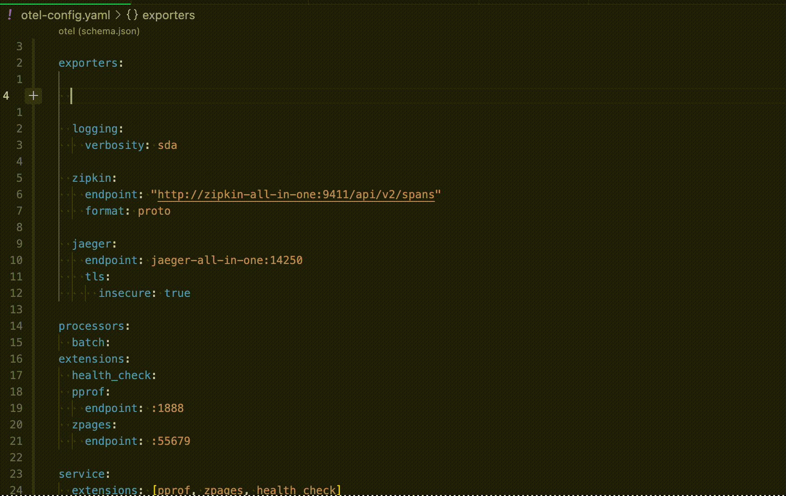
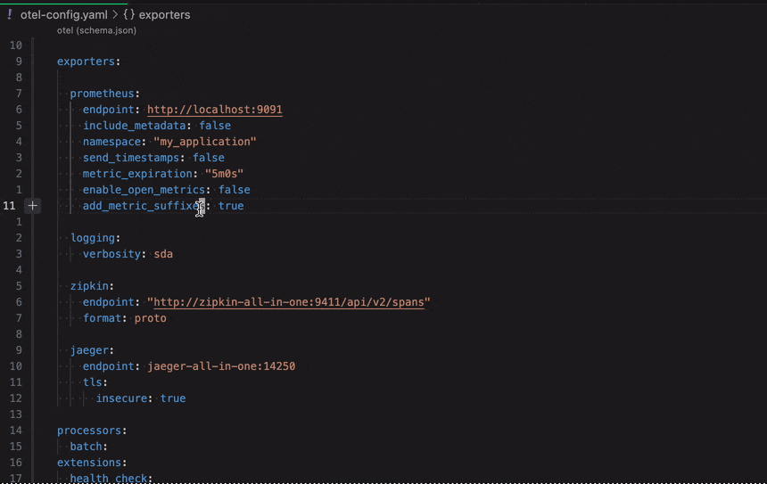
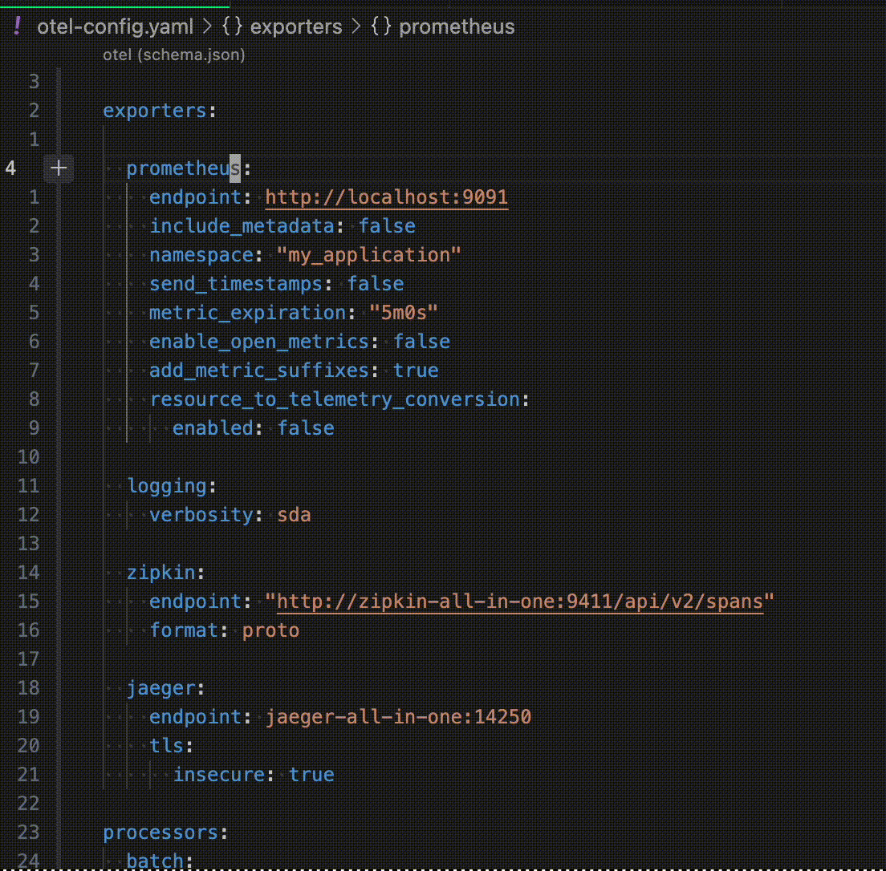

# OTEL Validator

OTEL Validator is a tool for validating your [otel-collector](https://opentelemetry.io/docs/collector/) configuration. 

It supports autocomplete of fields, inline documentation, and validation of the your otel configuration. 

## Features

### Autocomplete

Intellisense for all components and properties



### Inline Documentation

Documentation for supported configurations



### Config Validation

Real time validation of fields



## Getting Started

Open up an otel-config. If you don't have one handy, feel free to copy and paste the following example into a new file: "otel-config.yaml".

> NOTE: currently, OTEL validator will automatically check all `yaml` files that match the prefix `otel*`

```yaml
exporters:

  logging:
    verbosity: sda

  zipkin:
    endpoint: "http://zipkin-all-in-one:9411/api/v2/spans"
    format: proto

  jaeger:
    endpoint: jaeger-all-in-one:14250
    tls:
      insecure: true

processors:
  batch:
extensions:
  health_check:
  pprof:
    endpoint: :1888
  zpages:
    endpoint: :55679

service:
  extensions: [pprof, zpages, health_check]
  pipelines:
    traces:
      receivers: [otlp]
      processors: [batch]
      exporters: [logging, zipkin, jaeger]
    metrics:
      receivers: [otlp]
      processors: [batch]
      exporters: [logging, prometheus]
```
## Limitations

- doesn't currently support [connectors](https://opentelemetry.io/docs/collector/configuration/#connectors)
- all components can be null - we currently don't detect whether a property is required or optional
- `durations` are currently tread as strings. this means values like `5m_foobar` will not be flagged

## Acknowledgements

This extension makes use of the output of [cfgmetadatagen](https://github.com/open-telemetry/opentelemetry-collector-contrib/blob/main/cmd/configschema/cfgmetadatagen/cfgmetadatagen/README.md) which extracts configuration metadata from various collector components. 
